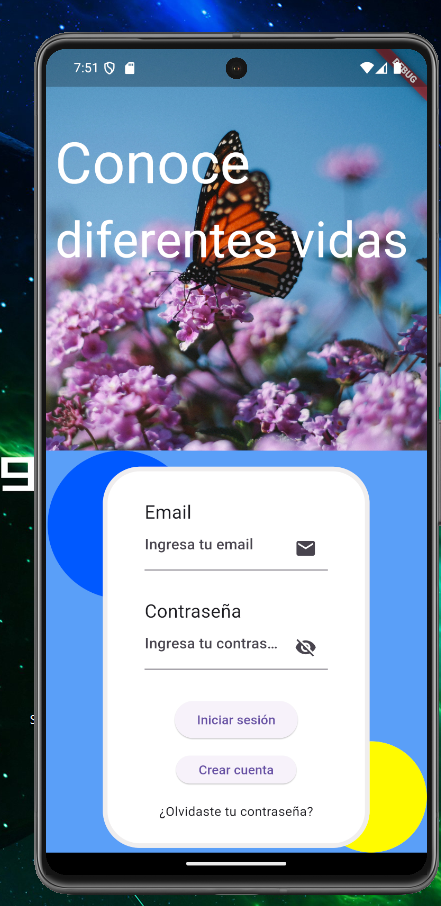
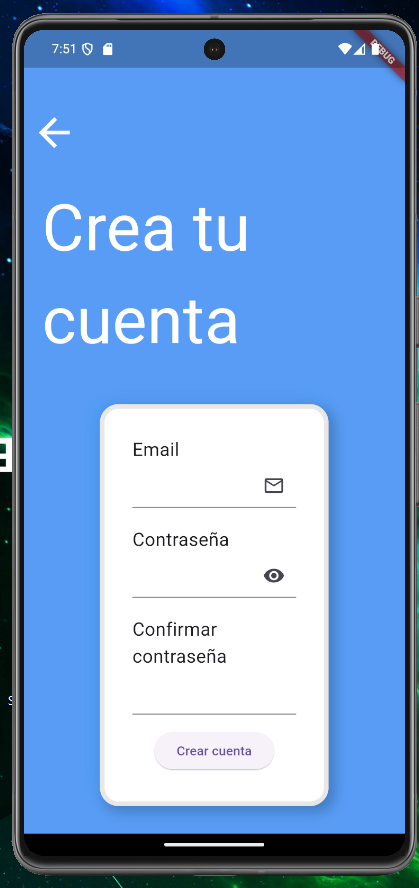
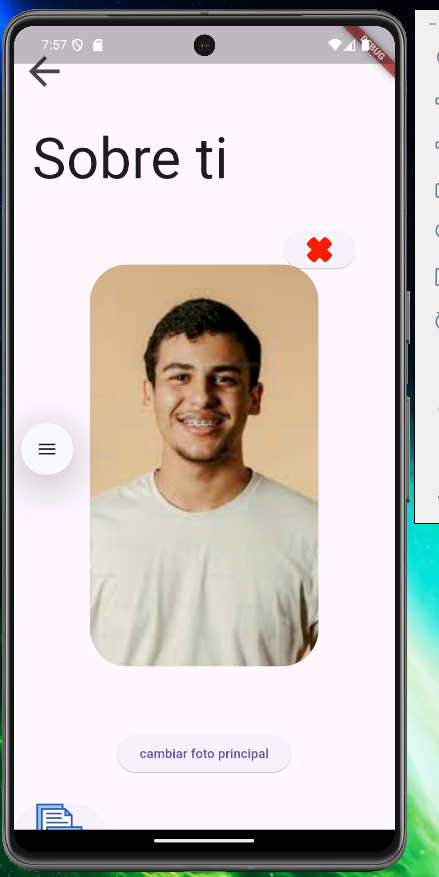
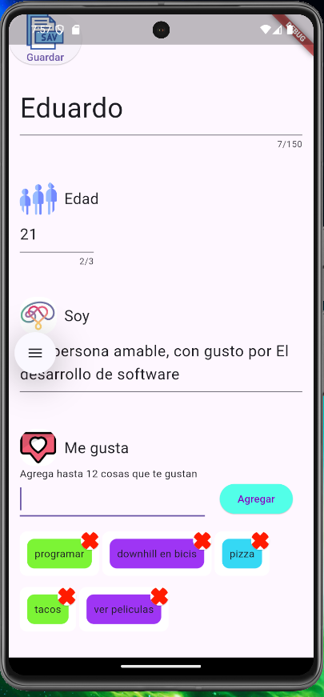
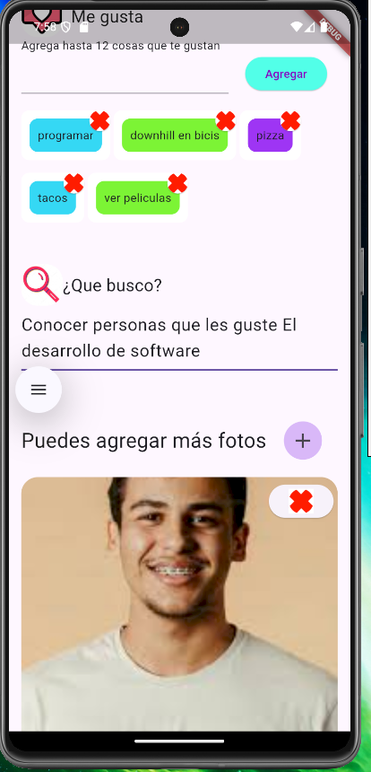
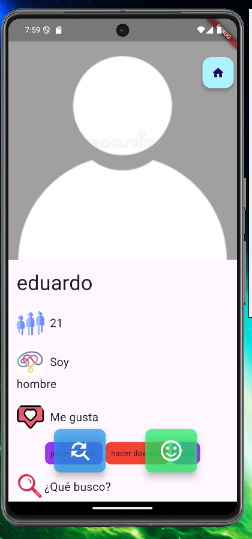
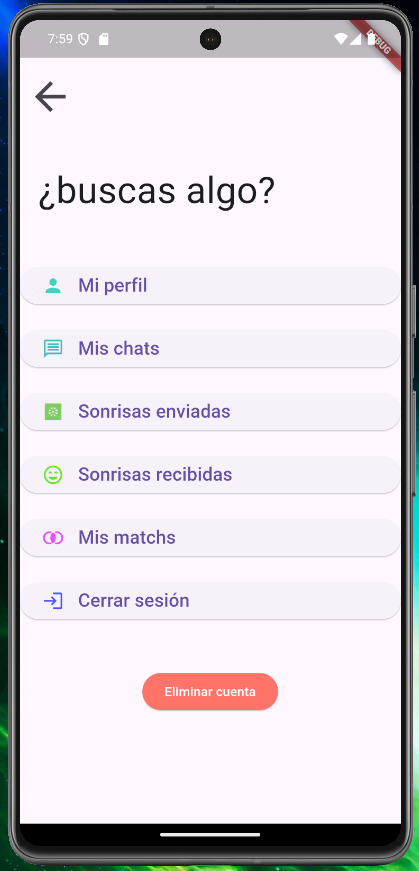

# sabira

Plataformas: Android y ios

Framework: Flutter

Lenguaje de programación: Dart

Backend: Node.js Epress con firestore de firebase (Código del backend no disponible en GitHub)

---- Estado: En construcción

Servicios de firebase:

Firestore (Base de datos no relacional)
Storage: Almacenamiento en la nube para guardar imagenes
Authentication: Servicio de autenticación y creación de usuarios 
Cloud Messaging: Servicio para notificaciónes push

¿Qué es Sabira? 

Es una aplicación móvil de citas, donde el objetivo es un lugar para concocer nuevas personas.

